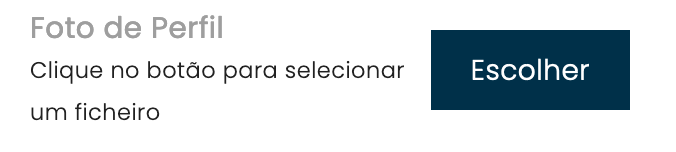

# Custom File Input

-   **Files:**
    -   `custom-file-input.ts`: TypeScript File on Angular Component
    -   `custom-file-input.sass`: SASS File on Angular Component (I prefer use SASS to CSS or SCSS)
    -   `custom-file-input.html`: HTML File on Angular Component

With this code you can have a input file like below image:

