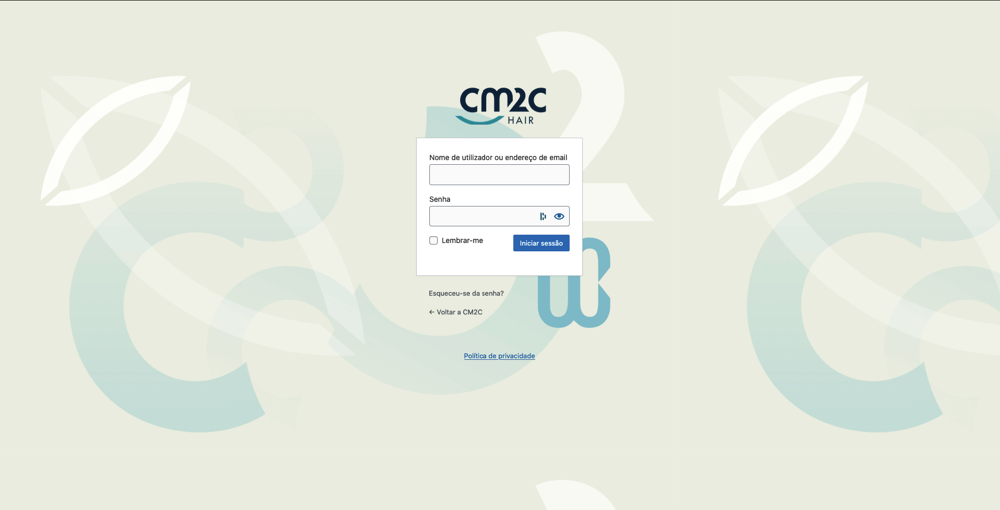

# Customize WordPress default login

* **Code:** `customize-login.php`

With this code you can change look of default WordPress Login without plugins

## Result

> **Note:** on example I used inline **CSS**, but you can add a **CSS** file with all style.

## CSS *Class's*

+ **`body.login`:** Background
+ **`body.login div#login h1 a`:** WordPress Logo
+ **`body.login div#login form#loginform`:** Form White Box
+ **`body.login div#login form#loginform p label`:** Label of username and password input
+ **`body.login div#login form#loginform input`:** Form inputs <small>(username and password)</small>
+ **`body.login div#login form#loginform input#user_login`:** Username Input
+ **`body.login div#login form#loginform input#user_pass`:** Password Input
+ **`body.login div#login form#loginform p.forgetmenot`:** Remember Checkbox
+ **`body.login div#login form#loginform p.submit input#wp-submit`:** Login button
+ **`body.login div#login p#nav a`:** Reset password link and other links
+ **`body.login div#login p#backtoblog a`:** Link back to website

## How to use

You can use this code two ways :
1. Using **[Code Snippets](https://pt.wordpress.org/plugins/code-snippets/)** plugin
2. Add on `functions.php` file (theme folder)
   * Recommend use **child theme** to add modifications.