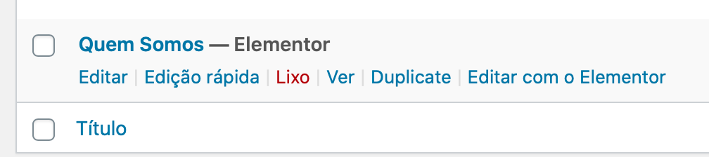

# Duplicate **Pages** and **Posts** without plugin

* **File:** `duplicate-button.php`

## Result

## How to use

You can use this code two ways :

1. Using **[Code Snippets](https://pt.wordpress.org/plugins/code-snippets/)** plugin
2. Add on `functions.php` file (theme folder)

   * Recommend use **child theme** to add modifications.
