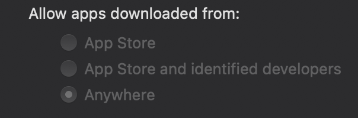

<a href="https://github.com/TutoDS"></a>

# Fix Damaged App in macOS

If you try install any app outside **AppStore** and see the message below, keep calm!

```D
"AppName.app" is damaged and can't be opened. You should move it to the Trash.
```

This message is showed because **Apple** remove in **Security Options** the **Anywhere** option in **"Allow apps downloaded from"** <small>(in **Security & Privacy** menu)</small>. But you can enable this option run a simple command in your terminal (see more above).

<a href="#"></a>

## Command

```bash
sudo spctl --master-disable
```

After you run this command in your Terminal and go to **Security & Privacy** menu, you can see the **"Anywhere"** option, and if try open the app again, no error!

Simple and fast! 👌