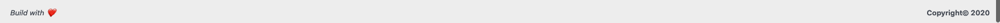
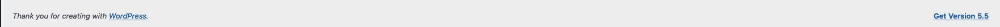

# Admin Branding

Makes the WordPress admin feel built for the client: a personal greeting, quick links, the site's own icon and your credit in the footer.

-   **File:** `admin-branding.php`

## What it does

* **Admin bar:** removes the WordPress logo and uses the site icon next to the site name, in the admin and on the front end. "Howdy, Name" becomes a time-based greeting: "Bom dia, Rodney" before 13h, "Boa tarde" until 20h, then "Boa noite".
* **Dashboard welcome banner:** a greeting plus shortcut buttons at the top of the dashboard: Novo produto, Encomendas and Clientes when WooCommerce is active (HPOS aware), then Novo artigo and Ver site, and a support link if an email is set. Each button only shows when the user has the matching permission.
* **Shop summary in the banner (WooCommerce):** four cards, each linking to the matching list or report: orders today, sales this month, orders waiting to be processed (highlighted when there are any) and low-stock products (amber when there are any). The numbers are cached for 10 minutes, and the cache clears when an order or stock changes.
* **Brand colours:** `primary` and `primary_dark` colour the active and hovered menu items, primary and secondary buttons, links and input focus. Lighter and darker shades are derived from them. Set `primary` to an empty string to keep the WordPress colours.
* **Dashboard widgets:** rounded card style, the same as the banner.
* **Simpler panel for non-admins** (users without `manage_options`): the widgets in `hide_widgets` and the menus in `hide_menus` are hidden. Admins always see everything.
* **Dashboard cleanup:** hides WordPress News, Quick Draft and the default Welcome panel. Site Health stays for admins only.
* **Footer:** "Site desenvolvido por <you>" on the left, plus a support link if an email is set. The right side shows the site name and current year, and admins also see the WordPress version.

## Settings

Edit the array in `tds_admin_branding_settings()`:

| Key | What it is |
|---|---|
| `developer` / `developer_url` | Your name and link in the footer |
| `support_email` | Empty hides the support links |
| `greetings` | Morning, afternoon and evening words |
| `texts` | Every visible label, so it can be translated |

## Result

### Admin Footer

#### Before Changes

## How to use

You can use this code in three ways:

1. Using **[WPCode](https://wordpress.org/plugins/insert-headers-and-footers/)** or **[Code Snippets](https://wordpress.org/plugins/code-snippets/)**, as a PHP snippet that runs everywhere
2. Add it to `functions.php` in your theme folder

    - Use a **child theme**, so theme updates don't remove it.
3. Combine it with [`customize-login`](../customize-login/) for a fully branded panel.
