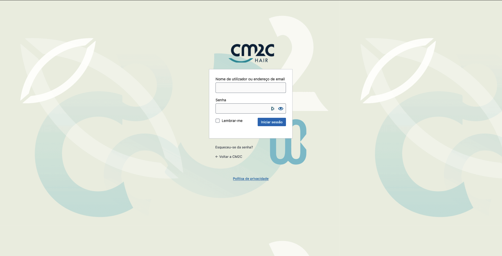

# Customize WordPress default login

* **Code:** `customize-login.php`

Brands the default WordPress login page without a plugin. It works with custom login URLs (WPS Hide Login and similar).

## What it does

* Uses the site logo (**Appearance → Customize → Site Identity**). If there's none, it falls back to the site icon. You can also set a logo URL directly.
* Applies brand colours to the background, button, focus ring and links, with a rounded card and soft shadow.
* Points the logo link to the site home page, and uses the site name as its accessible text.
* Hides the language dropdown below the form.

## Settings

Edit the array in `tds_login_settings()`:

| Key | Default | What it is |
|---|---|---|
| `logo` | `''` | Logo URL. Empty uses the site logo, then the site icon |
| `logo_width` / `logo_height` | `220` / `80` | Logo box in px (the image keeps its proportions) |
| `primary` / `primary_dark` | `#2eb8dc` / `#0f7896` | Button, focus and link colours |
| `text` | `#1d2327` | Labels |
| `background` | `#f3f7f9` | Page background colour |
| `background_image` | `''` | Optional full-page background image URL |

## Result

## CSS classes

+ **`body.login`:** Background
+ **`body.login div#login h1 a`:** Logo
+ **`body.login div#login form#loginform`:** Form box
+ **`body.login div#login form#loginform p label`:** Username and password labels
+ **`body.login div#login form#loginform input`:** Form inputs <small>(username and password)</small>
+ **`body.login div#login form#loginform p.forgetmenot`:** Remember me checkbox
+ **`body.login div#login form#loginform p.submit input#wp-submit`:** Login button
+ **`body.login div#login p#nav a`:** Reset password and register links
+ **`body.login div#login p#backtoblog a`:** Link back to the website

## How to use

You can use this code in three ways:
1. Using **[WPCode](https://wordpress.org/plugins/insert-headers-and-footers/)** or **[Code Snippets](https://wordpress.org/plugins/code-snippets/)**, as a PHP snippet that runs everywhere
2. Add it to `functions.php` in your theme folder
   * Use a **child theme**, so theme updates don't remove it.
3. Combine it with [`admin-branding`](../admin-branding/) for a fully branded panel.
