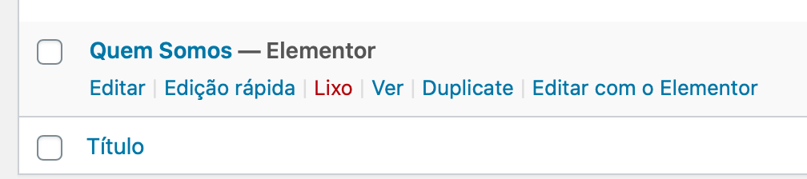

# Duplicate **Pages** and **Posts** without plugin

> **Native alternative:** WordPress core has no duplicate action. WooCommerce already adds "Duplicate" to products, so this snippet is only needed for posts, pages and other post types.

The copy is saved as a draft owned by the current user, with its terms and custom fields. Only users who can edit the original and create items of that post type see the link.

* **File:** `duplicate-button.php`

## Result

## How to use

You can use this code two ways :

1. Using **[Code Snippets](https://pt.wordpress.org/plugins/code-snippets/)** plugin
2. Add on `functions.php` file (theme folder)

   * Recommend use **child theme** to add modifications.
